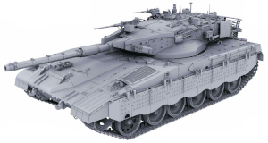

# Merkava

Some examples with STM32F10x standard peripheral library.

## Base on

- MCU **STM32F103ZET6**
- Keil uVision V5.28.0.0
- STM32F10x standard peripheral library 3.5.0.

## Directory description

- **CMSIS**：内核驱动程序；
- **Libraries**：片上外设固件库；
- **Startup**：汇编启动程序；
- **Sources**：用户功能代码；
- **Common**：封装的通用功能；
- **Drivers**：BSP 板级支持包。
